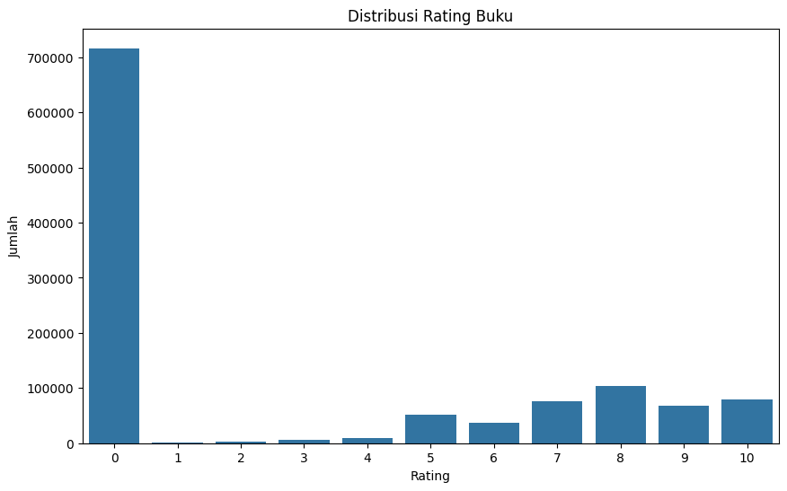
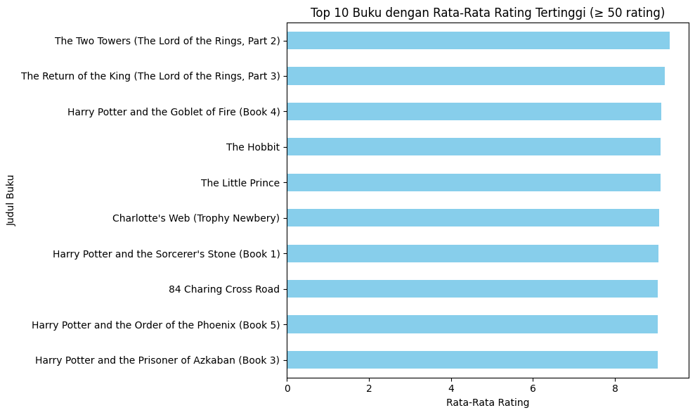

# Rekomendasi Buku Berbasis Content-Based dan Collaborative Filtering

## Project Overview

Sistem rekomendasi buku berbasis teknologi kini menjadi kebutuhan esensial dalam mendukung pengalaman personalisasi pengguna di dunia literasi digital. Dalam era big data dan pertumbuhan masif platform berbagi ulasan buku, pengguna dihadapkan pada tantangan besar dalam menemukan buku yang sesuai dengan selera atau minat tertentu. Tidak hanya soal preferensi genre, banyak pengguna juga ingin menemukan buku yang cocok dengan penulis favorit, penerbit, maupun tahun publikasi.

Berdasarkan hal tersebut, proyek ini dibangun untuk mengembangkan sistem rekomendasi buku dengan memanfaatkan pendekatan **machine learning**, khususnya **content-based filtering** dan **collaborative filtering**. Dua pendekatan ini memungkinkan sistem memberikan rekomendasi berdasarkan:

* **Karakteristik buku** (judul, penulis, penerbit)
* **Perilaku dan preferensi pengguna** (riwayat rating, pola interaksi)

Tujuan utama proyek ini bukan hanya menyajikan rekomendasi buku populer, tetapi **buku yang relevan secara kontekstual dan personal bagi setiap pengguna**. Dalam jangka panjang, sistem seperti ini juga berpotensi membantu platform literasi dalam meningkatkan **retensi pengguna**, mengurangi **bounce rate**, dan memberikan nilai tambah melalui **fitur pintar berbasis data**.

---

## Dataset dan Referensi

**Dataset:** [Books Dataset](https://www.kaggle.com/datasets/saurabhbagchi/books-dataset)

* Berisi lebih dari 700.000 interaksi pengguna dan 180.000+ resep
* Dua file utama digunakan:
    * `books.csv` — data buku yang ada
    * `ratings.csv` — rating yang diberikan user kepada setiap buku

---

## Business Understanding

### Problem Statement

1.  Pengguna kesulitan menemukan buku yang sesuai dengan preferensi atau kebiasaan sebelumnya karena volume data yang besar dan tidak terstruktur.
2.  Sistem rekomendasi konvensional belum mampu memahami preferensi personal pengguna secara tepat.

### Goals

1.  Memberikan rekomendasi buku mirip berdasarkan konten (judul, penulis, penerbit).
2.  Memberikan rekomendasi buku yang disukai user lain dengan pola serupa.

### Solution Statement

1.  **Content-Based Filtering**: Menggunakan TF-IDF dan cosine similarity untuk mencari buku yang mirip dari sisi konten.
2.  **Collaborative Filtering**: Menggunakan Artificial Neural Network (ANN) untuk mempelajari pola interaksi user-item dari rating pengguna.

---

## Data Understanding

Dataset digunakan dari [Books Dataset](https://www.kaggle.com/datasets/saurabhbagchi/books-dataset).

### Dataset Overview Yang Digunakan

| Dataset | Jumlah Baris | Jumlah Kolom | Keterangan |
|---|---|---|---|
| `books.csv` | 271,360 | 8 | Data buku yang ada (ISBN, Book-Title, Book-Author, Year-Of-Publication, Publisher, Image URLs) |
| `ratings.csv` | 1,149,780 | 3 | Rating yang diberikan user kepada setiap buku (User-ID, ISBN, Book-Rating) |

### Detail Fitur Setiap Dataset

#### `books.csv` (8 kolom)

| Kolom | Tipe Data | Missing |
|---|---|---|
| `ISBN` | object | 0 |
| `Book-Title` | object | 0 |
| `Book-Author` | object | 2 |
| `Year-Of-Publication` | object | 0 |
| `Publisher` | object | 2 |
| `Image-URL-S` | object | 0 |
| `Image-URL-M` | object | 0 |
| `Image-URL-L` | object | 3 |

Kolom yang digunakan untuk content-based filtering adalah: `Book-Title`, `Book-Author`, `Publisher`.

#### `ratings.csv` (3 kolom)

| Kolom | Tipe Data | Missing |
|---|---|---|
| `User-ID` | int64 | 0 |
| `ISBN` | object | 0 |
| `Book-Rating` | int64 | 0 |

Kolom yang digunakan untuk collaborative filtering adalah: `User-ID`, `ISBN`, `Book-Rating`.

### Data Quality:

* **Missing Values**:
    * `books.csv`: Kolom `Book-Author`, `Publisher`, dan `Image-URL-L` mengandung missing values (masing-masing 2, 2, dan 3 entri). Kolom `Year-Of-Publication` juga memiliki missing values setelah konversi tipe data.
    * `ratings.csv`: Tidak ditemukan nilai kosong.
* **Duplicate Rows**:
    * Tidak ditemukan data duplikat pada kedua dataset.

---

## Exploratory Data Analysis (EDA)

Untuk memahami karakteristik data sebelum diterapkan ke model rekomendasi, dilakukan eksplorasi data visual dan statistik. Berikut beberapa visualisasi kunci dan insight yang dihasilkan:

### 1. Distribusi Rating Pengguna terhadap Buku



Distribusi ini menunjukkan frekuensi dari setiap nilai rating yang diberikan pengguna terhadap buku di platform. Terlihat bahwa:

* Banyak buku yang tidak memiliki rating (rating 0).
* Distribusi ini **tidak seimbang (imbalanced)**, dan perlu menjadi pertimbangan saat melakukan pelatihan model.

### 2. Top 10 Buku dengan Rata-Rata Rating Tertinggi (min 50 rating)



Visualisasi ini menggambarkan buku-buku dengan rata-rata rating tertinggi yang memiliki minimal 50 rating. Insight yang diperoleh:

* Buku-buku populer seperti "The Two Towers", "The Return of the King", dan seri "Harry Potter" memiliki rata-rata rating yang tinggi.
* Data ini menyoroti buku-buku yang paling disukai oleh sebagian besar pengguna.

---

## Data Preparation

### 1. Handling Missing Values (all data)

* `Year-Of-Publication` diubah menjadi tipe data datetime, dengan `errors='coerce'` untuk mengubah nilai yang tidak valid menjadi `NaT`.
* Baris yang mengandung missing values di `df_books` dihapus (`dropna`).

### 2. Content-Based Filtering Preprocessing

1.  **Pembuatan Fitur `text`**:
    * Tiga kolom utama yaitu `Book-Title`, `Book-Author`, dan `Publisher` digabung menjadi satu string teks panjang yang disebut sebagai `text`.
    * Semua teks diubah menjadi huruf kecil.
    * Ini menghasilkan deskripsi utuh setiap buku yang mencakup judul, penulis, dan penerbit dalam satu format teks.

2.  **TF-IDF Vectorization**:
    * Setelah kolom `text` siap, teks tersebut dikonversi menjadi representasi numerik menggunakan TF-IDF (Term Frequency-Inverse Document Frequency).

    * TF-IDF bekerja dengan menghitung bobot kata berdasarkan frekuensi relatifnya dalam dokumen tertentu dibanding seluruh dokumen:

        $$TFIDF(t,d) = TF(t,d) \times \log\left(\frac{N}{DF(t)}\right)$$

        Dimana:

        * `TF(t,d)`: Frekuensi kata `t` dalam dokumen `d`
        * `N`: Jumlah total dokumen
        * `DF(t)`: Jumlah dokumen yang mengandung kata `t`

    * Dalam implementasi ini digunakan `TfidfVectorizer` dari `sklearn` dengan parameter:
        * `stop_words='english'`: menghilangkan kata umum bahasa Inggris

    * Hasil akhirnya adalah **matriks sparse** dengan dimensi `(266733, 115578)` yang mewakili bobot pentingnya kata-kata dalam masing-masing buku. Matriks ini menjadi input untuk proses content-based filtering menggunakan cosine similarity.

### 3. Collaborative Filtering Preprocessing

1.  **Encoding Identitas**:
    * Menggunakan `LabelEncoder` untuk mengubah `User-ID` dan `ISBN` menjadi ID numerik berurutan agar dapat digunakan sebagai indeks dalam embedding layer.
    * Hanya rating yang lebih dari 0 yang digunakan untuk encoding.

2.  **Pemisahan Data**:
    * Fitur input (`X`) dan target (`y`) dipisahkan dari `df_ratings` (setelah encoding) dan kemudian dibagi menjadi training dan testing set menggunakan `train_test_split` dengan rasio 80:20 dan `random_state=42`.

---

## Modeling and Results

### Content-Based Filtering

Sistem ini memanfaatkan pendekatan content-based filtering, yaitu merekomendasikan buku yang mirip berdasarkan kesamaan konten teks antara buku, terutama pada kolom `Book-Title`, `Book-Author`, dan `Publisher`.

#### 1. Cosine Similarity

Untuk mengukur kemiripan antar buku, digunakan rumus cosine similarity. Cosine similarity menghitung sudut antara dua vektor TF-IDF, di mana nilai kemiripan berkisar antara 0 (tidak mirip) hingga 1 (identik). Model `NearestNeighbors` dari `scikit-learn` digunakan untuk mengimplementasikan pendekatan ini dengan `metric='cosine'` dan `algorithm='brute'`.

#### 2. Fungsi Rekomendasi

Setelah vektor TF-IDF terbentuk, fungsi rekomendasi `recommend_fast()` dibuat untuk mencari buku yang paling mirip dengan buku input berdasarkan nilai cosine similarity tertinggi.

Contoh pemanggilan fungsi:

```python
recommend_fast("The Hobbit")
```
#### 3. Hasil Inference

Hasil inferensi untuk buku "The Hobbit" menunjukkan rekomendasi buku-buku lain yang memiliki judul, penulis, atau penerbit yang serupa, seperti berbagai edisi "The Hobbit" atau buku terkait lainnya oleh J. R. R. Tolkien.

#### 4. Penyimpanan Model

Model NearestNeighbors dan TfidfVectorizer serta objek indices (mapping judul buku ke indeks TF-IDF) tidak disimpan dalam notebook yang diberikan, namun prosesnya dapat direplikasi dari kode yang ada.

### Collaborative Filtering (Deep Learning)

Model ini menggunakan pendekatan collaborative filtering berbasis neural network, yang mempelajari hubungan antara user dan item (buku) dari interaksi rating pengguna.

#### 1. Arsitektur Model

Model dibangun menggunakan TensorFlow dan Keras, dengan struktur embedding untuk user dan item. Prediksi rating dilakukan dengan dot product antara embedding user dan item.

```python
# Input layers
user_input = Input(shape=(1,))
book_input = Input(shape=(1,))# Embedding layers
user_embedding = Embedding(input_dim=num_users+1, output_dim=embedding_dim)(user_input)
book_embedding = Embedding(input_dim=num_books+1, output_dim=embedding_dim)(book_input)# Dot product of embeddings
dot_product = Dot(axes=2)([user_embedding, book_embedding])
dot_product = Flatten()(dot_product)

model = Model(inputs=[user_input, book_input], outputs=dot_product)
```

Rumus prediksi yang digunakan adalah:

$$\hat{r}_{ui} = \mathbf{p}_u \cdot \mathbf{q}_i$$
Dimana:

* $\mathbf{p}_u$: vektor embedding user
* $\mathbf{q}_i$: vektor embedding item
* $\hat{r}_{ui}$: prediksi rating user $u$ terhadap item $i$

#### 2. Konfigurasi Training

* Loss Function: `mse` (Mean Squared Error)
* Optimizer: `adam`
* Batch Size: 64
* Epochs: 5

Contoh kode training:

```python
model.fit([X_train[:, 0], X_train[:, 1]], y_train, epochs=5, batch_size=64, verbose=1)
```

#### 3. Inferensi dan Rekomendasi

Setelah model dilatih, prediksi dilakukan dengan memberikan pasangan `[user_id, book_id]` dan mengembalikan estimasi rating yang mungkin diberikan user tersebut terhadap buku.

Contoh pemanggilan fungsi:

```python
recommend_books_for_user(
user_id_original=276726,
df_ratings=df_ratings,
df_books=df_books,
user_encoder=user_enc,
book_encoder=book_enc,
model=model,
top_n=5  # top 5 rekomendasi
)
```

#### 4. Hasil Inference

Hasil inferensi untuk User-ID 276726 menunjukkan 5 rekomendasi buku teratas dengan perkiraan ratingnya.

#### 5. Penyimpanan Model

Untuk mempermudah deployment dan pengujian ulang, model disimpan ke dalam file `.h5`.

```python
model.save('recommender_model.h5')
```

Selain itu, `user_encoder` dan `book_encoder` juga disimpan menggunakan `joblib`.

```python
joblib.dump(user_enc, 'user_encoder.pkl')
joblib.dump(book_enc, 'book_encoder.pkl')
```

## Evaluasi

### Metode Evaluasi yang Digunakan

#### 1. Mean Squared Error (MSE) (Collaborative Filtering)

MSE digunakan untuk mengukur selisih rata-rata kuadrat antara nilai rating aktual dengan prediksi model terhadap data validasi.

$$MSE = \frac{1}{n} \sum_{i=1}^{n} (y_i - \hat{y}_i)^2$$
Hasil Evaluasi:
MSE = Tidak ditampilkan secara langsung di notebook, namun bisa dihitung dari RMSE.

#### 2. Root Mean Squared Error (RMSE) (Collaborative Filtering)

RMSE adalah ukuran kesalahan yang lebih mudah diinterpretasikan karena berada dalam skala yang sama dengan rating aktual.
$$RMSE = \sqrt{MSE}$$

Hasil Evaluasi:
RMSE = 6.0514
RMSE ini menunjukkan bahwa prediksi model memiliki deviasi rata-rata sebesar 6.0514 terhadap nilai rating aktual.

### Visualisasi Kurva Pelatihan

Tidak ada kurva pelatihan yang ditampilkan dalam notebook yang diberikan untuk model collaborative filtering.

---

### Perbandingan Content-Based dan Collaborative Filtering

#### Ringkasan Performa Model

| Model | Metrik | Nilai |
|---|---|---|
| Content-Based Filtering | (Tidak ada metrik evaluasi kuantitatif spesifik seperti Precision@K yang ditampilkan untuk content-based filtering dalam notebook. Hasilnya disajikan secara kualitatif.) | |
| Collaborative Filtering | RMSE | 6.0514 |

#### Perbandingan Menyeluruh

| Aspek Evaluasi | Content-Based Filtering | Collaborative Filtering |
|---|---|---|
| **Dasar pendekatan** | Berdasarkan kemiripan teks antar item (buku). | Berdasarkan pola interaksi user-item (rating pengguna). |
| **Input data utama** | Kolom teks: Book-Title, Book-Author, Publisher. | Kolom rating: User-ID, ISBN, Book-Rating. |
| **Metrik evaluasi** | (Kualitatif: Rekomendasi relevan secara semantik) | RMSE: 6.0514 |
| **Kemampuan personalisasi** | Tidak secara langsung memperhitungkan preferensi unik per pengguna. | Disesuaikan dengan pola preferensi pengguna. |
| **Kelebihan** | Memberikan rekomendasi yang sangat relevan secara semantik berdasarkan deskripsi buku. | Menangkap preferensi tersembunyi antar pengguna. |
| **Keterbatasan** | Tidak responsif terhadap perbedaan selera tiap pengguna. | Tidak dapat menangani item baru tanpa histori interaksi (cold-start item). |
| **Cold start untuk user baru** | Tidak berlaku (hanya butuh nama buku). | Memerlukan histori interaksi minimal. |
| **Cold start untuk item baru** | Dapat direkomendasikan berdasarkan konten. | Tidak dapat direkomendasikan tanpa interaksi sebelumnya. |

---

### Keterkaitan antara Problem Statement, Goals, dan Solusi yang Diberikan

Proyek ini dimulai dengan dua pernyataan masalah utama yang dihadapi oleh pengguna dalam menjelajahi dan menemukan buku yang sesuai.

1.  **Masalah pertama** berkaitan dengan kesulitan pengguna dalam menemukan buku yang relevan dengan preferensi atau kebiasaan mereka, terutama karena volume data buku yang besar dan tidak terstruktur.
2.  **Masalah kedua** adalah bahwa sistem rekomendasi konvensional umumnya tidak mampu memahami preferensi pengguna secara personal, sehingga rekomendasi yang dihasilkan kurang tepat sasaran.

---

Untuk menjawab **masalah pertama**, proyek ini menetapkan tujuan untuk membangun sistem **rekomendasi berbasis konten** yang dapat menyarankan buku mirip berdasarkan informasi buku seperti judul, penulis, dan penerbit.

Solusi yang dikembangkan adalah **Content-Based Filtering** menggunakan **TF-IDF** untuk mengubah konten buku menjadi representasi numerik, dan kemudian menggunakan **cosine similarity** untuk mengukur kemiripan antar buku.

Dengan pendekatan ini, sistem mampu:

* Menemukan buku yang serupa secara semantik.
* Memberikan rekomendasi tanpa perlu interaksi pengguna sebelumnya (mengatasi cold-start untuk item).
* Meningkatkan efisiensi eksplorasi katalog buku oleh pengguna.

---

Untuk menjawab **masalah kedua**, tujuan yang ditetapkan adalah mengembangkan sistem yang mampu **mempelajari preferensi pengguna berdasarkan interaksi historis**, seperti rating terhadap buku.

Solusi yang diimplementasikan adalah **Collaborative Filtering** berbasis **deep learning** dengan menggunakan **Artificial Neural Network (ANN)**.

Model ini bekerja dengan:

* Membangun embedding untuk pengguna dan item.
* Menggabungkan embedding tersebut dengan dot product.
* Memberikan prediksi rating yang mencerminkan preferensi personal pengguna.

Dengan demikian, sistem dapat memberikan:

* Rekomendasi yang **terpersonalisasi**.
* Kemampuan untuk mengenali pola tersembunyi dari interaksi pengguna lain yang serupa.
* Nilai tambah bagi pengguna dalam bentuk pengalaman penggunaan yang lebih relevan dan menarik.

Kedua pendekatan ini, content-based dan collaborative filtering, dirancang untuk **menjawab masing-masing pernyataan masalah dan mencapai goals yang ditetapkan**. Content-based filtering menangani masalah ketidakterstrukturan data dan kebutuhan untuk merekomendasikan buku baru, sedangkan collaborative filtering menangani kebutuhan akan personalisasi berbasis interaksi pengguna.
